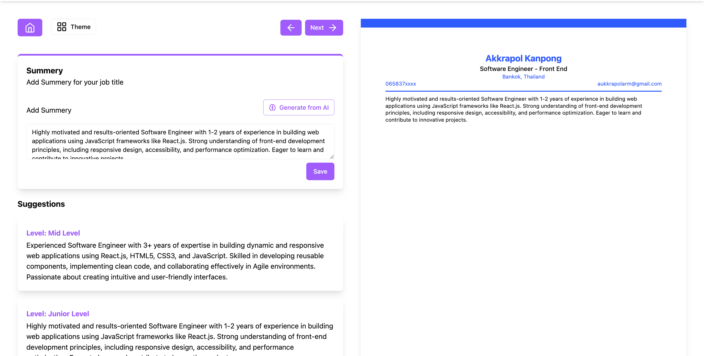
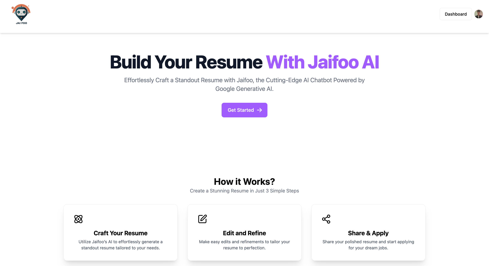
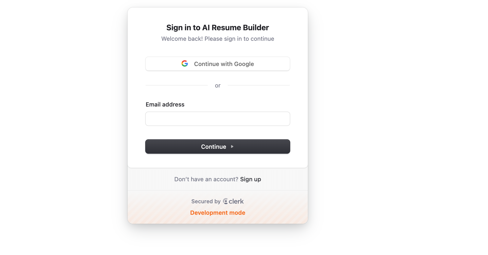
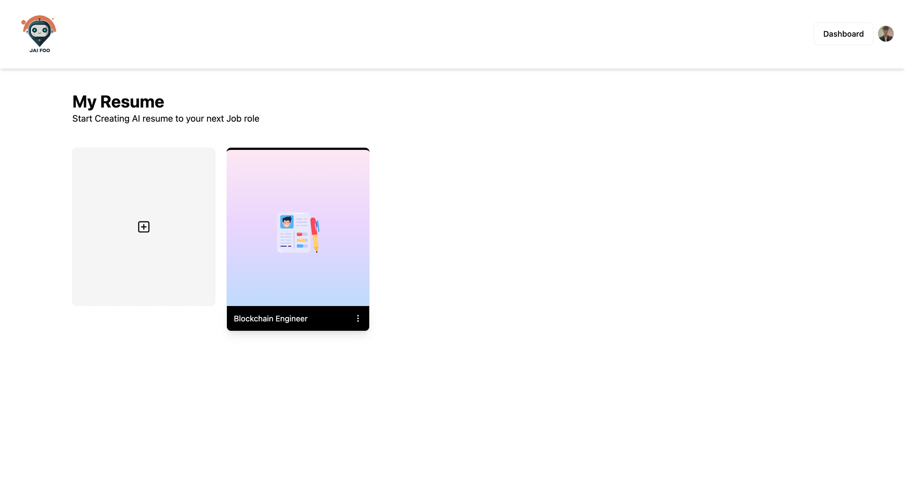
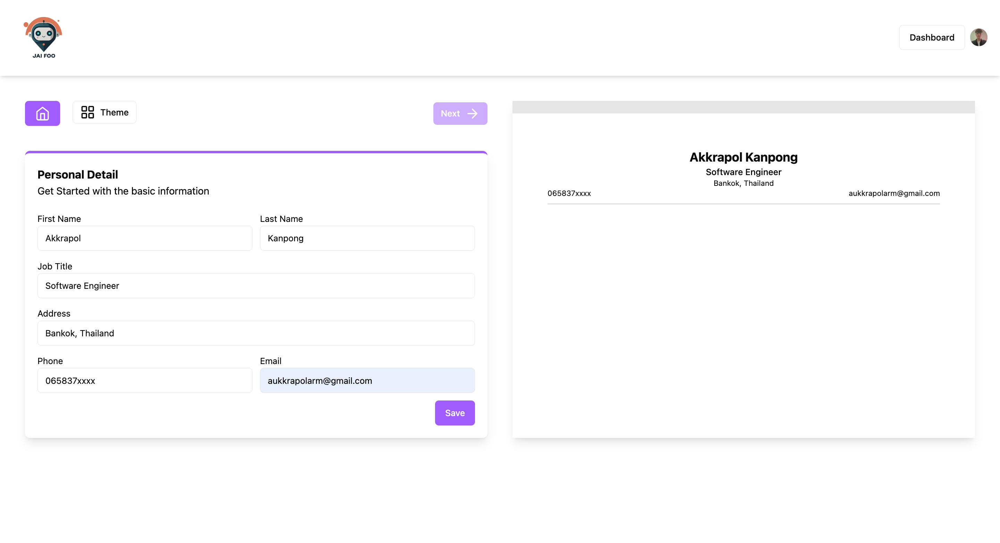
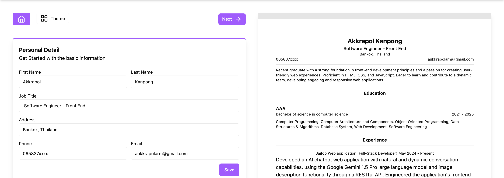

 
  
   
  <h3 align="center">AI Resume Builder 🤖</h3>
  

     AI Resume Builder built with ReactJS, Strapi and Google Generative AI.
    

## 📋 <a name="table">Table of Contents</a>

1. 🤖 [Introduction](#introduction)
2. ⚙️ [Tech Stack](#tech-stack)
3. 🔋 [Features](#features)
4. 🚀 [More](#more)

## <a name="introduction">🤖 Introduction</a>
- Built an AI-powered resume builder application using React and integrated the Google Large Language
Model APIs (Google Gemini) to provide suggestions and formatting recommendations. Tailwind CSS
was employed to create a responsive and visually appealing user interface.
- Designed and implemented a content management system (CMS) and user authentication using
RESTful APIs, with Clerk providing secure and seamless user authentication.

## <a name="tech-stack">⚙️ Tech Stack</a>

- **Programming language:** HTML, CSS, Javascript
- **Library & Framwork:** ReactJS, Strapi, Clerk, Tailwind, Radix UI
- **Database:** MySQL
- **Generative AI:** Google Generative AI (Google Gemini 1.5 Flash)
- **Tools** VSCode, Git and Github

## <a name="features">🔋 Features</a>

👉 AI-powered resume building: Utilizes Google Generative AI to provide intelligent suggestions and formatting recommendations.

👉 Profile summary generation: AI system offers personalized suggestions for crafting an impactful summary of your professional profile.

👉 Experience detailing assistance: Provides AI-driven recommendations for writing comprehensive and engaging descriptions of your work experiences.

👉 Markdown-based resume editing: Includes a user-friendly form for editing your resume using Markdown, allowing for easy formatting and customization.

👉 Content management: Utilizes Strapi as a headless CMS for efficient content management and organization.

## <a name="more">🚀 More</a>

  
  
  

  
  
  

  

